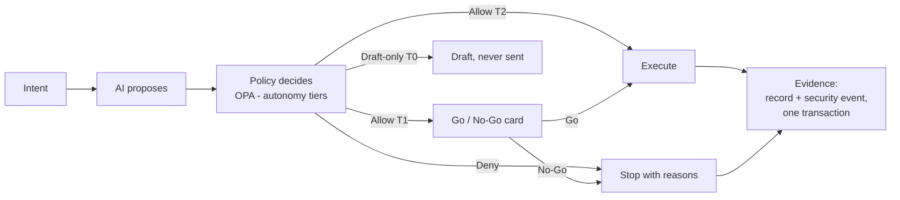

# AI Chief of Staff

**A leader-agnostic AI chief of staff governed by executable policy.**

AI can run a leader's operations — track commitments, prep meetings, send follow-ups. It cannot decide alone what it is allowed to do.



> **AI proposes. Policy decides. Deterministic systems execute. Everything is audited.**

The system serves a *principal* — any leader, at any level. No leader-specific logic exists anywhere: identity, delegation scope, and autonomy live in ZITADEL users, OPA policy data, and config. Onboarding a new leader is a data change, not a deploy.

---

## What it does

| Capability | How |
|------------|-----|
| **Commitment tracking** | Who owes what to whom, due when; both directions; slip counts |
| **Real calendar** | iCal feed connector → governed ingestion → graph; prep briefs pull open threads with attendees |
| **Notes → commitments** | LLM extracts explicit promises from meeting notes; files them through the governed write path; vague talk ignored |
| **Delegated actions** | send/draft email, nudge owners — with **autonomy tiers**: T0 draft-only, T1 Go/No-Go confirm, T2 auto+log |
| **Decision memory** | What was decided, by whom, on what basis; supersedes chain (nothing deleted) |
| **Morning brief** | Today's meetings, overdue, due-soon, repeat slippers, actions awaiting Go/No-Go, LLM "top of mind" |
| **Eligibility vs audit** | *Who can act* = live OPA; *who did act* = graph history with the policy basis that allowed it |

## Architecture (one paragraph)

Every mutation goes: identity → **OPA preflight** (`allow` + `allow_basis` + tier) → business record **plus security event written in one MongoDB transaction**. Kafka Connect CDC streams both to Kafka; an indexer denormalizes them into a **Neo4j graph** (people, meetings, commitments, decisions, actions, audit events). Chat sends each question through **one LLM routing call** (strict JSON `RouterDecision`; deterministic fallback without a key), then executes deterministically — Cypher plans and formatters, live OPA for eligibility, scripted skills for mutations. No free-form agent loop touches production state.

Full design: **[docs/architecture-spec.md](docs/architecture-spec.md)** (starts with a plain-language key-concepts table).

## Demo

Chat UI at `http://localhost:8002` — persona switcher (Principal / Chief of Staff / Delegate / Unauthorized), routing transparency on every answer, clickable Go/No-Go cards.

<!-- Demo video: record the UI (QuickTime), then drag the .mov into this README
     using GitHub's web editor - it uploads and embeds automatically. -->

60-second script: as **Chief of Staff**, "send an email to partner@example.com …" → Go/No-Go card → Go → executed and audited. Switch to **Unauthorized**, same ask → policy denies with reasons. Ask "who can send email" (live policy) vs "who created C-…" (audit history). Finish with "morning brief."

## Try it

```bash
cd platform
docker compose up -d          # Mongo rs0, Kafka+Connect, Neo4j, OPA, services
./scripts/register-connectors.sh
./scripts/verify.sh && ./scripts/verify-phase2.sh   # prove the spine
open http://localhost:8002    # demo UI
```

Optional `.env` in `platform/` (never committed): `ANTHROPIC_API_KEY` for semantic routing + extraction + brief narrative; `CALENDAR_ICS_URL` for a real calendar feed.

## Proof, not promises

Every phase ships with a black-box verify script, and routing has a golden eval bank:

| Prove | Script |
|-------|--------|
| Spine: txn writes → CDC → Kafka; OPA allow/deny | `platform/scripts/verify.sh` |
| Commitments end-to-end + chat | `platform/scripts/verify-phase2.sh` |
| Meetings, calendar sync, prep briefs | `platform/scripts/verify-phase3.sh` |
| Action tiers, Go/No-Go, double-confirm rejection | `platform/scripts/verify-phase4.sh` |
| Notes → extraction (vague statements ignored) | `platform/scripts/verify-phase5.sh` |
| Morning brief sections | `platform/scripts/verify-phase6.sh` |
| Decision memory + supersedes chain | `platform/scripts/verify-phase7.sh` |
| **Routing golden evals (26 cases, 10 intent families)** | `platform/scripts/prove-routing.sh` |

## Layout

| Path | What | Port |
|------|------|------|
| `docs/architecture-spec.md` | Full architecture spec | — |
| `platform/` | docker-compose, OPA policy, CDC connectors, verify scripts, eval bank | — |
| `services/commitment-service` | Commitments (governed writes) | 8001 |
| `services/cos-chat` | Router + handlers + demo UI | 8002 |
| `services/meeting-service` | Meetings, notes, LLM extraction | 8003 |
| `services/action-service` | Delegated actions, tiers, Go/No-Go | 8004 |
| `services/decision-service` | Decision memory, supersedes | 8005 |
| `services/cos-indexer` | Kafka → Neo4j pipelines | — |
| `services/calendar-connector` | iCal feed → meeting-service | — |
| `legacy/` | Earlier single-file prototype (ingest → extract → brief) | — |

## Honest boundaries

- Execution is an **outbox** (rendered, stored, audited — not delivered); swapping in SMTP/Graph API changes one function.
- Dev identity is header-based; ZITADEL is provisioned in compose (`--profile auth`) but JWT validation isn't wired yet.
- Retrieval is graph-only; the vector/embedding leg of the spec is not built.
- The LLM can misroute a question; control lives on **execution and decisions**, which are deterministic and policy-gated.
